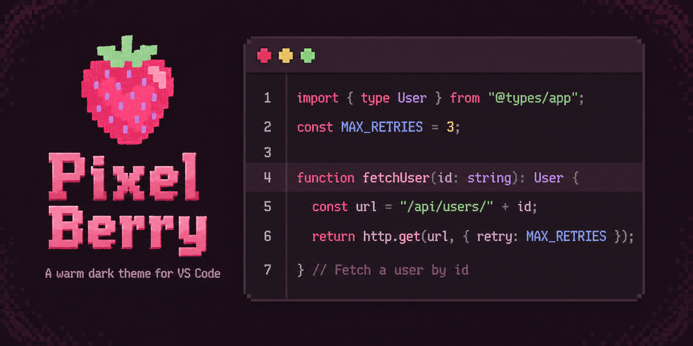
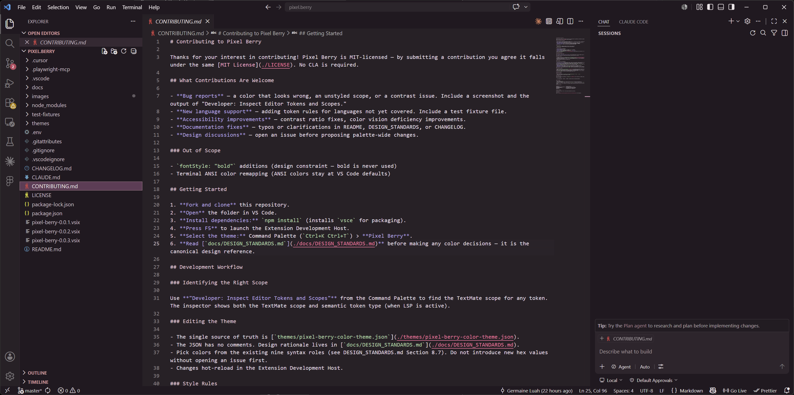
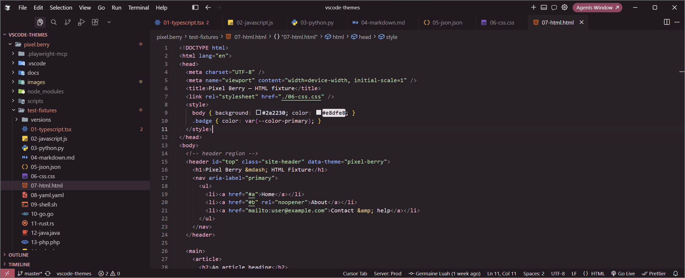
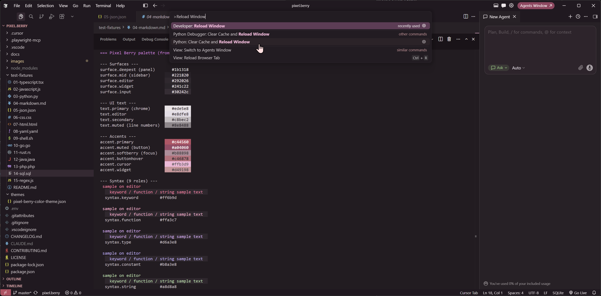

# Pixel Berry

[](https://marketplace.visualstudio.com/items?itemName=germainelry.pixel-berry)
[](https://open-vsx.org/extension/germainelry/pixel-berry)
[](LICENSE)

A warm, cozy dark theme with wine/burgundy surfaces, raspberry accents, and distinct rose-pink and berry-toned syntax. Designed for long coding sessions. Compatible with VS Code, Cursor, VSCodium, Windsurf, and other editors that support VS Code extensions.

<p align="center">
  
</p>

## Overview

A dark theme with warm wine/burgundy surfaces layered into a quiet gradient — editor, sidebar, panel. Berry pink keywords, lavender-violet types, rose pink functions, and muted sage strings give each token a distinct role without being harsh.

## Screenshots







## Installation

### VS Code

1. Open **Extensions** (`Ctrl+Shift+X`)
2. Search for **Pixel Berry**
3. Click **Install**, then select it from the theme picker (`Ctrl+K Ctrl+T`)

### Open VSX (VSCodium, Windsurf, and other compatible editors)

1. Open **Extensions** in your editor
2. Search for **Pixel Berry** on the [Open VSX Registry](https://open-vsx.org/extension/germainelry/pixel-berry)
3. Click **Install**, then select it from the theme picker

### Manual Install (.vsix)

1. Download the latest `.vsix` from [GitHub Releases](https://github.com/germainelry/pixel-berry-vscode-theme/releases)
2. In your editor: **Extensions** > `...` menu > **Install from VSIX...**
3. Or from the command line:
   ```bash
   code --install-extension pixel-berry-0.1.2.vsix
   ```

## Contributing

Contributions are welcome! See [CONTRIBUTING.md](./CONTRIBUTING.md) for setup instructions, design constraints, and how to submit a pull request.

## Support

Pixel Berry is free and built in my spare time. If it brightened your editor, a coffee goes a long way toward the next release. ♥

[](https://ko-fi.com/germainelry)

## License

MIT — see [LICENSE](./LICENSE).
